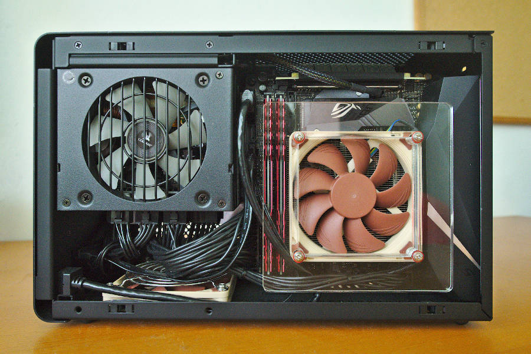

# NH-L9i fan duct

This repository contains the files to laser cut a fan duct for the NH-L9i.

I cut each layer on a 5 mm acrylic sheet, for a total thickness of 10 mm. I used the longer screws provided with the L9i (M3 x 26mm). Tightening the screws too much might crack the acrylic.

I tested with an i7-8700 and a dual fan 1060 in a Dan A4 SFX case. I ran Prime95 and Furmark simultaneously for 30 minutes and kept the highest moving average temperatures for the CPU, GPU and SSD over a 2 minutes window. I repeated this 3 times on distinct days and kept the average. Each day the results were within 1C of the average. The aircon was set to 27C.

Without fan duct:
- CPU: 88C
- GPU: 70C
- SSD: 63C

With fan duct:
- CPU: 79C
- GPU: 70C
- SSD: 55C

The fan duct reduced the CPU and SSD temperatures by 8-9C.
